<div align="center">



<a href="https://github.com/amannarang04">
  
</a>

<br/>

[](https://github.com/amannarang04)
[](https://www.linkedin.com/in/YOUR-LINKEDIN/)
[](mailto:YOUR-EMAIL@example.com)


</div>

---

## `01 // CHARACTER SHEET`

```text
> NAME      : Aman Narang
> CLASS     : AI / ML Engineer
> SUBCLASS  : Full-stack Builder
> TITLE     : Hackathon Hero
> MISSION   : build useful things · learn fast · ship faster
> STATUS    : open to collaborations, internships, hackathon teams
```

## `02 // EQUIPPED SKILLS`

<div align="center">


<br/>


<br/>


**Magic school:** `GenAI` `RAG` `NLP` `Embeddings` `XGBoost`

</div>

## `03 // ACTIVE QUESTS`

| Quest | Objective | Stack |
|---|---|---|
| 🛡️ **VEYORA** | AI-powered women's safety wearable ecosystem | `Python` `AI/ML` `IoT` |
| 🎓 **Mentor Logins** | Mentorship platform connecting students with mentors | `React` `Node.js` `SQL` |
| 💳 **NextWave Transaction** | AI-based transaction categorisation | `Python` `NLP` `XGBoost` |
| ✈️ **Flight Price Tracker** | Flight search, tracking and price intelligence | `Python` `FastAPI` `React` |

> 🔗 Repo links lagane ke liye project name ko `[**Name**](https://github.com/amannarang04/repo-name)` se replace karo.

## `04 // LIVE STATS`

Level, XP, achievements, language inventory and quest log in the card above are **computed from real GitHub data and refreshed every 6 hours** by GitHub Actions.

<div align="center">


<br/>

### `> press start to continue_`

</div>
